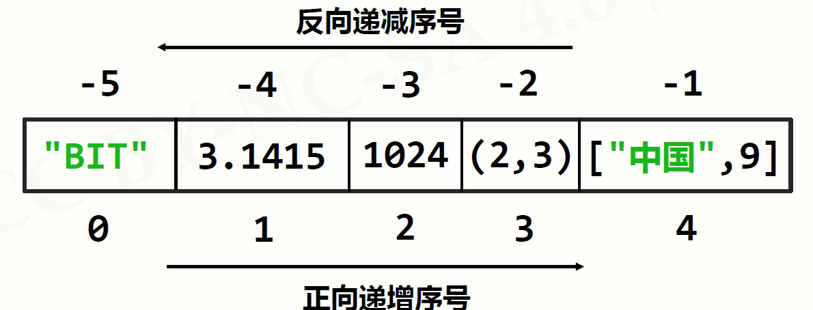
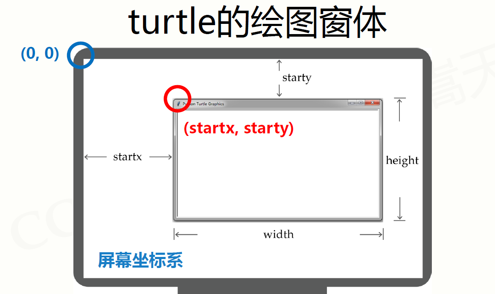
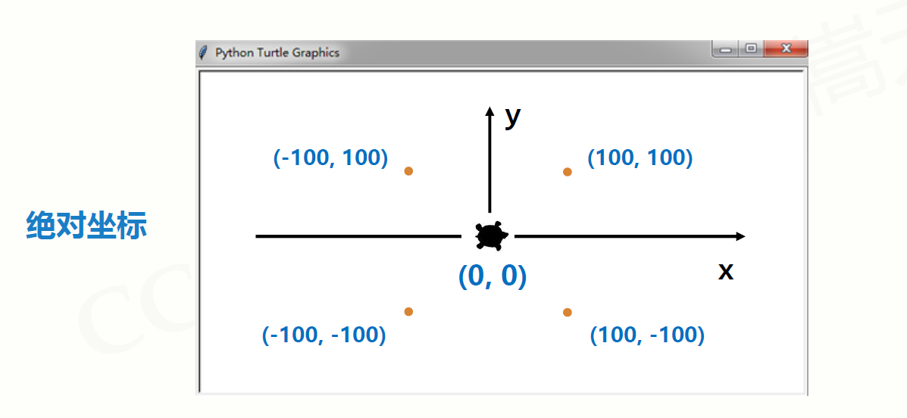
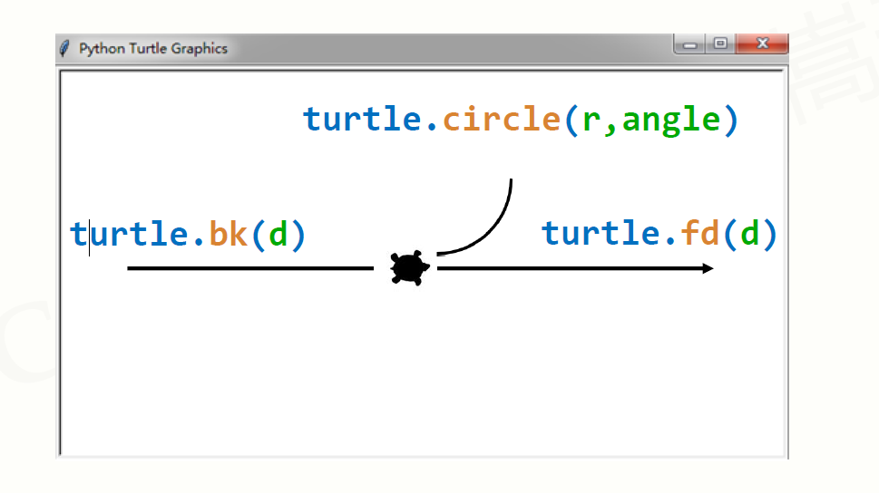
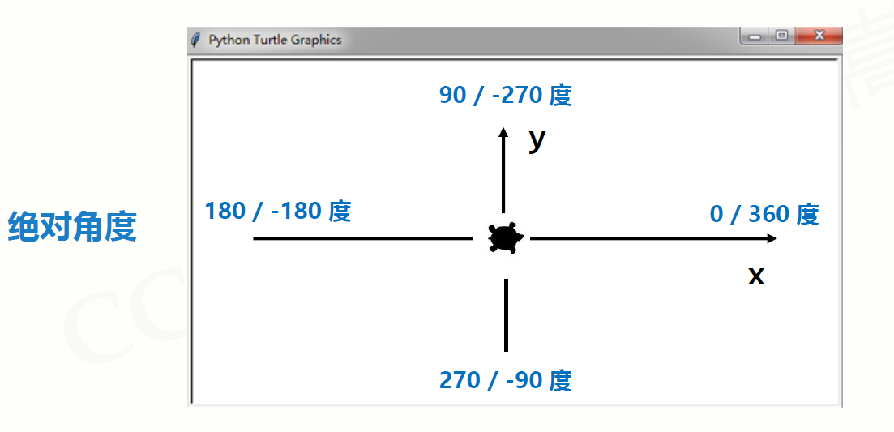
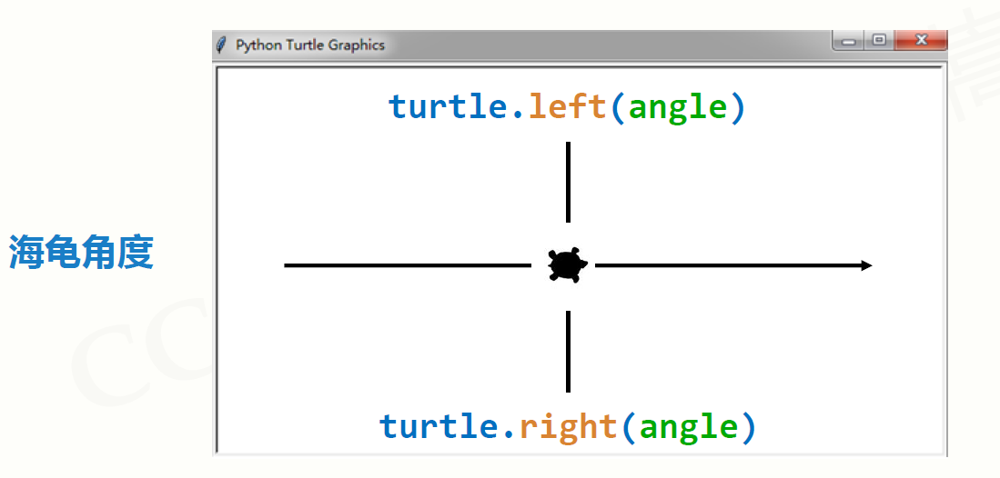
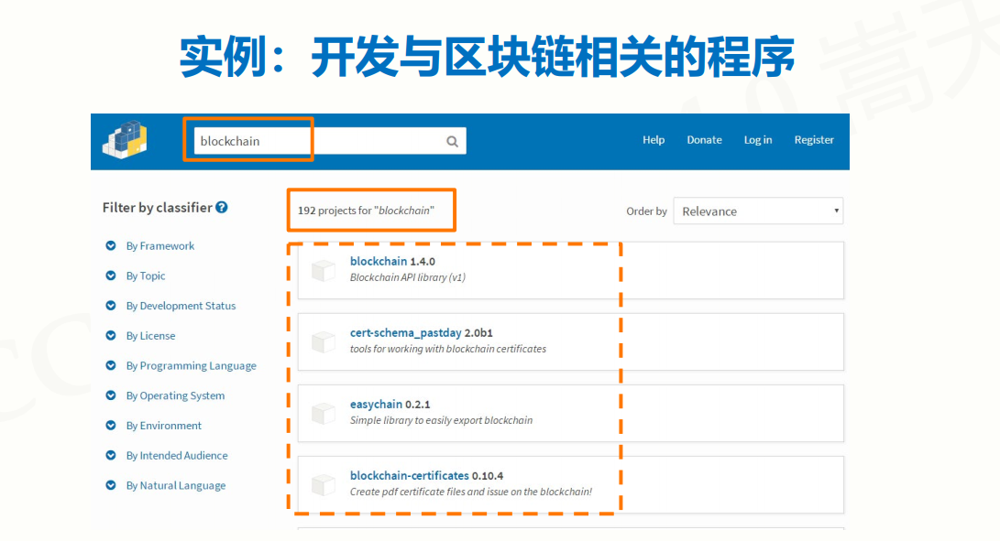

[TOC]

# 关于pyhton

- Python语言是通用语言
- Python语言是脚本语言
- Python语言是开源语言
- Python语言是跨平台语言
- Python语言是多模型语言
Python语言创立者:
Guido van Rossum  
2002年，Python 2.x   
2008年，Python 3.x

# python基础语法

## 程序的格式框架

代码高亮：编程的色彩辅助体系，不是语法要求

### 缩进

一行代码开始前的空白区域，表达程序的格式框架

缩进表达程序的格式框架

- 严格明确：缩进是语法的一部分，缩进不正确程序运行错误
- 所属关系：表达代码间包含和层次关系的唯一手段
- 长度一致：程序内一致即可，一般用 4 个空格或 1 个 TAB

### 注释
用于提高代码可读性的辅助性文字，不被执行

不被程序执行的辅助性说明信息

- 单行注释：以 开头，其后内容为注释

    ```python
        #这里是单行注释
    ``` 

- 多行注释 ：以 开头和结尾

    ```python
    ''' 这是多行注释第一行
    这是多行注释第二行 '''
    ```

## 命名与保留字

### 变量

程序中用于保存和表示数据的占位符号

变量采用标识符(名字) 来表示，关联标识符的过程叫命名

可以使用等号(=)向变量赋值或修改值，=被称为赋值符号

### 命名

### 关联标识符的过程

命名规则: 大小写字母、数字、下划线和中文等字符及组合

注意事项: 大小写敏感、首字符不能是数字、不与保留字相同

### 保留字

被编程语言内部定义并保留使用的标识符

Python语言有35个保留字(也叫关键字)

Python语言有35个保留字(也叫关键字)

if 是保留字，If 是变量

## 分支语法

### 条件判断

用于条件组合的**三个保留字**

| 操作符及使用 | 描述                 |
| ------------ | -------------------- |
| x and y      | 两个条件x和y的逻辑与 |
| x or y       | 两个条件x和y的逻辑或 |
| not x        | 条件x的逻辑非        |

| 操作符 | 数学符号 | 描述     |
| ------ | -------- | -------- |
| <      | <        | 小于     |
| <=     | ≤        | 小于等于 |
| >=     | ≥        | 大于等于 |
| >      | >        | 大于     |
| ==     | =        | 等于     |
| ！ =   | ≠        | 不等于   |

```python
if <condition>: <statement>
```

**special：**

```python
if not bool: statementd
```

二分支紧凑形式

```python
<statement> if <condition> else <statement>
```

多分支

注意
> 是elif，不是else if

```python
if <条件1> :
<语句块1>
elif <条件2> :
<语句块2>
……
else :
<语句块N>
```

## 循环结构

遍历某个结构形成的循环运行方式
- 从遍历结构中逐一提取元素，放在循环变量中

```python
for <循环变量> in <遍历结构> :
    <语句块> 
```

由保留字for和in组成，完整遍历所有元素后结束

每次循环，所获得元素放入循环变量，并执行一次语句块

### 计数循环(N次)

- 遍历由range()函数产生的数字序列，产生循环

```python
for i in range(N) :
    <语句块> 
```

字符串遍历循环
- s是字符串，遍历字符串每个字符，产生循环

```python
for c in s :
    <语句块> 
```

```python
>>> for c in "Python123":
print(c, end=",")
P,y,t,h,o,n,1,2,3,
```

ls是一个列表， 遍历其每个元素，产生循环

```python
for item in ls :
    <语句块>
>>> for item in [123, "PY", 456] :
print(item, end=",")
123,PY,456,
```

文件遍历循环
- fi是一个文件标识符，遍历其每行，产生循环

  ```python
  for line in fi :
    <语句块>
  ```

### while

由条件控制的循环运行方式

- 反复执行语句块，直到条件不满足时结束

```python
while <条件> :
    <语句块>
```

### 循环控制保留字

**break 和 continue**

- break跳出并结束当前整个循环，执行循环后的语句
- continue结束当次循环，继续执行后续次数循环
- break和continue可以与for和while循环搭配使用 

### 循环的扩展(else)

循环与else

- 当循环没有被break语句退出时，执行else语句块
- else语句块作为"正常"完成循环的奖励
- 这里else的用法与异常处理中else用法相似 

```python
while <条件> :
    <语句块1>
else :
    <语句块2>

for <变量> in <遍历结构> :
    <语句块1>
else :
    <语句块2>
```

```python
>>> for c in "PYTHON" :
if c == "T" :
continue
print(c, end="")
else:
print("正常退出")
PYHON正常退出

>>> for c in "PYTHON" :
if c == "T" :
break
print(c, end="")
else:
print("正常退出")
PY
```

## import库

### import:使用库名调用

```python
import <libaryName>
import <libaryName> as <alias>
```

### form:能直接调用函数

当我们使用from * 的时候，会取得模块顶层左右赋值的变量名的拷贝。

```python
from 库 import 函数名
from 库 import *
<functionName>(argc)
```

## 输入输出

### print()

以字符串形式向控制台输出的函数

```python
print({}.format()) {}表示槽，后续format()填入
```

### input()

```python
input([prompt])
```

**在一行输入多个数字**

```python
a, b, c, d = map(int, input().split())
```

## 函数的定义与使用

### 函数的定义

函数是一段代码的表示  

- 函数是一段具有特定功能的、可重用的语句组
- 函数是一种功能的抽象，一般函数表达特定功能
- 两个作用：降低编程难度和代码复用

```python
def<函数名>(<参数(0个或多个)>):
	<函数体>
	return<返回值>
```

### 函数的调用

调用是运行函数代码的方式

调用时要给出实际参数

- 实际参数替换定义中的参数
- 函数调用后得到返回值

### 可选参数传递

函数定义时可以为某些参数指定默认值，构成可选参数

```javascript
def<函数名>(<非可选参数>,<可选参数>):
	<函数体>
	return<返回值>
```

例如：

```python
def fact(n,m=1) :
    s = 1
    foriinrange(1, n+1):
    s *= i
    return s//m
```

### 可变参数传递

```python
def <函数名> (<参数>, *b):
    <函数体>
    return <返回值>
```

例如  

```python
def fact(n, *b) :
    s = 1
    for i in range(1, n+1):
    s *= i
    for item in b:
    s *= item
    return s
```

### 函数的返回值

函数可以返回0个或**多个结果**

- return保留字用来传递返回值
- 函数可以有返回值，也可以没有，可以有return，也可以没有
- return可以传递0个返回值，也可以传递任意多个返回值

### 局部变量和全局变量

#### 规则1: 局部变量和全局变量是不同变量

- 局部变量是函数内部的占位符，与全局变量可能重名但不同
- 函数运算结束后，局部变量被释放
- 可以使用global保留字在函数内部使用全局变量

```python
n, s = 10, 100
def fact(n) :
    global s #fact()函数中使用global保留字声明此处s是全局变量s
    for i in range(1, n+1):
    s *= i
    return s
print(fact(n), s)
```

```python
运行结果
>>>
362880000 362880000
```

规则2: 局部变量为组合数据类型且未创建，等同于全局变量

```python
ls = ["F", "f"] #通过使用[]真实创建了一个全局变量列表ls
def func(a) :
    ls.append(a) #此处ls是列表类型，未真实创建则等同于全局变量
    return
func("C") #局部变量ls被修改
print(ls)
```

```python
运行结果
>>>
['F', 'f']
```

#### 使用规则

- 基本数据类型，无论是否重名，局部变量与全局变量不同
- 可以通过global保留字在函数内部声明全局变量
- 组合数据类型，如果局部变量未真实创建，则是全局变量

#### lambda函数

lambda函数返回函数名作为结果

- lambda函数是一种匿名函数，即没有名字的函数
- 使用lambda保留字定义，函数名是返回结果
- lambda函数用于定义简单的、能够在一行内表示的函数

```python
<函数名> = lambda<参数> : <表达式>
```

等价于

```python
def <函数名> (<参数>):
    <函数体>
    return <返回值>
```

# 基本数据类型及其操作

## 数字类型

### 整数类型

**与数学中整数的概念一致**

- **可正可负，没有取值范围限制**
- pow(x,y)函数：计算 xy，想算多大算多大
```python
pow(2,100)
1267650600228229401496703205376
pow(2,pow(2,15))
1415461031044954789001553…… 
```

4种进制表示形式
- 十进制： 1010, 99, -217
- 二进制，以0b或0B开头： 0b010, -0B101
- 八进制，以0o或0O开头： 0o123, -0O456
- 十六进制，以0x或0X开头： 0x9a, -0X89 

### 浮点数类型

**与数学中实数的概念一致**

- 带有小数点及小数的数字

- 浮点数取值范围和小数精度都存在限制，但常规计算可忽略

- 取值范围数量级约-10307至10308，精度数量级10-16 

  浮点数间运算存在不确定尾数，不是bug

```python
0.1 + 0.3
0.4
0.1 + 0.2
0.30000000000000004 #不确定尾数 
```

- round(x, d)：对x四舍五入， d是小数截取位数
- 浮点数间运算与比较用round()函数辅助
- 不确定尾数一般发生在10-16左右， round()十分有效 

**浮点数可以采用科学计数法表示**

- 使用字母e或E作为幂的符号，以10为基数，格式如下：
<a>e<b> 表示 a*10b
- 例如： 4.3e-3 值为0.0043 9.6E5 值为960000.0 


### 复数类型
与数学中复数的概念一致
如果x2 = -1，那么x的值是什么？

- 定义 j = -𝟏𝟏 ，以此为基础，构建数学体系
- a+bj 被称为复数，其中， a是实部， b是虚部 

复数实例
z = 1.23e-4+5.6e+89j

- 实部是什么？ z.real 获得实部
- 虚部是什么？ z.imag 获得虚部 

### 数值运算操作符 

**操作符是完成运算的一种符号体系**

| 操作符及使用 | 描述                                                       |
| ------------ | ---------------------------------------------------------- |
| x + y        | 加， x与y之和                                              |
| x – y        | 减， x与y之差                                              |
| x * y        | 乘， x与y之积                                              |
| x / y        | 除， x与y之商 10/3结果是3.3333333333333335                 |
| x // y       | 整数除， x与y之整数商 10//3结果是3                         |
| + x          | x本身                                                      |
| - y          | x的负值                                                    |
| x % y        | 余数，模运算 10%3结果是1                                   |
| x ** y       | 幂运算， x的y次幂， x^y;当y是小数时，开方运算10**0.5结果是 |

| 增强操作符及使用 | 描述                                                         |
| ---------------- | ------------------------------------------------------------ |
| x op= y          | 即 x = x op y，其中， op为二元操作符                         |
| x op= y          | x += y x -= y x *= y x /= y x //= y x %= y x **= y           |
| x op= y          | >>> x = 3.1415 >>> x **= 3  与 x = x **3 等价 31.006276662836743 |

### 数字类型的关系
类型间可进行混合运算，生成结果为"最宽"类型

- 三种类型存在一种逐渐"扩展"或"变宽"的关系：
**整数 -> 浮点数 -> 复数**
- 例如： 123 + 4.0 = 127.0 (整数+浮点数 = 浮点数) 

### 数值运算函数 

一些以函数形式提供的数值运算功能

| 函数及使用        | 描述                                                         |
| ----------------- | ------------------------------------------------------------ |
| abs(x)            | 绝对值， x的绝对值 abs(-10.01) 结果为 10.01                  |
| divmod(x,y)       | 商余， (x//y, x%y)，同时输出商和余数 divmod(10, 3) 结果为 (3, 1) |
| pow(x, y[, z])    | 幂余， (x**y)%z， [..]表示参数z可省略 pow(3, pow(3, 99), 10000) 结果为 4587 |
| round(x[, d])     | 四舍五入， d是保留小数位数，默认值为 round(-10.123, 2) 结果为 -10.12 |
| max(x1,x2, … ,xn) | 最大值，返回x1,x2, … ,xn中的最大值， n不限 max(1, 9, 5, 4, 3) 结果为 9 |
| min(x1,x2, … ,xn) | 最小值，返回x1,x2, … ,xn中的最小值， n不限 min(1, 9, 5, 4, 3) 结果为 1 |
| int(x)            | 将x变成整数，舍弃小数部分 int(123.45) 结果为123； int("123") 结果为123 |
| float(x)          | 将x变成浮点数，增加小数部分 float(12) 结果为12.0； float("1.23") 结果为1.23 |
| complex(x)        | 将x变成复数，增加虚数部分 complex(4) 结果为 4 + 0j           |

## 字符串

**由0个或多个字符组成的有序字符序列**
-字符串是字符的有序序列，可以对其中的字符进行索引

```python
"请"是"请输入带有符号的温度值: "的第0个字符
```

字符串有2类共4种表示方法
-由一对单引号或双引号表示，仅表示单行字符串

```python
"请输入带有符号的温度值: "或者'C'
```

-由一对三单引号或三双引号表示，可表示多行字符串

```python
'''Python
语言'''
```

三引号是多行注释

### 字符串的序号

正向递增序号和反向递减序号


### 字符串的使用

使用[ ]获取字符串中一个或多个字符

#### 索引：

返回字符串中单个字符    <字符串>[M]

```python
"请输入带有符号的温度值: "[0]或者TempStr[-1]
```

#### 切片：

返回字符串中一段字符子串     <字符串>[M: N]

```python
"请输入带有符号的温度值: "[1:3]或者TempStr[0:-1]
```

使用[M:N: K]根据步长对字符串切片

- <字符串>[M: N]，M缺失表示至开头，N缺失表示至结尾

  ```python
  "〇一二三四五六七八九十"[:3]结果是"〇一二"
  ```

- <字符串>[M: N: K]，根据步长K对字符串切片

  ```python
  "〇一二三四五六七八九十"[1:8:2] 结果是"一三五七"
  "〇一二三四五六七八九十"[::-1] 结果是"十九八七六五四三二一〇"
  ```
### 字符串的特殊字符

  转义符\

- 转义符表达特定字符的本意

  ```python
  "这里有个双引号(\")"结果为这里有个双引号(")
  ```

- 转义符形成一些组合，表达一些不可打印的含义

  ```python
  "\b"回退"\n"换行(光标移动到下行首)"\r"回车(光标移动到本行首)
  ```

### 字符串操作符

| 操作符及使用 | 描述                                    |
| ------------ | --------------------------------------- |
| x+ y         | 连接两个字符串x和y                      |
| n *x 或x *n  | 复制n次字符串x                          |
| x in s       | 如果x是s的子串，返回True，否则返回False |

### 字符串处理函数

| 函数及使用     | 描述                                                         |
| -------------- | ------------------------------------------------------------ |
| len(x)         | 长度，返回字符串x的长度<br/>len("一二三456") 结果为6         |
| str(x)         | 任意类型x所对应的字符串形式<br/>str(1.23)结果为"1.23"str([1,2])结果为"[1,2]" |
| hex(x)或oct(x) | 整数x的十六进制或八进制小写形式字符串<br/>hex(425)结果为"0x1a9"oct(425)结果为"0o651" |
| chr(u)         | x为Unicode编码，返回其对应的字符                             |
| ord(x)         | x为字符，返回其对应的Unicode编码                             |

**Unicode编码**

- 统一字符编码，即覆盖几乎所有字符的编码方式
- 从0到1114111(0x10FFFF)空间，每个编码对应一个字符
- **Python字符串中每个字符都是Unicode编码字符**

### 字符串处理方法

| 方法及使用                   | 描述                                                         |
| ---------------------------- | ------------------------------------------------------------ |
| str.lower()或str.upper()     | 返回字符串的副本，全部字符小写/大写<br/>"AbCdEfGh".lower()结果为"abcdefgh" |
| str.split(sep=None)          | 返回一个列表，由str根据sep被分隔的部分组成<br/>"A,B,C".split(",")结果为['A','B','C'] |
| str.count(sub)               | 返回子串sub在str中出现的次数<br/>"an apple a day".count("a")结果为4 |
| str.replace(old, new)        | 返回字符串str副本，所有old子串被替换为new<br/>"python".replace("n","n123.io")结果为<br/>"python123.io" |
| str.center(width[,fillchar]) | 字符串str根据宽度width居中，fillchar可选<br/>` "python".center(20,"=")结果为<br/>'=======python======='` |
| str.strip(chars)             | 从str中去掉在其左侧和右侧chars中列出的字符<br/>"= python= ".strip("=np")结果为<br/>"ytho"<br/> |
| str.join(iter)               | 在iter变量除最后元素外每个元素后增加一个str<br/>",".join("12345")结果为<br/>"1,2,3,4,5"#主要用于字符串分隔等 |

### 字符串类型的格式化
格式化是对字符串进行格式表达的方式

- 字符串格式化使用.format()方法，用法如下：

  ```python
  <模板字符串>.format(<逗号分隔的参数>)
  ```

  

#### format()方法的格式控制

槽内部对格式化的配置方式

```python
{ <参数序号> ：<格式控制标记>}
```

| ：       | <填充>             | <对齐>                               | <宽度>           | <,>              | <.精度>                                 | <类型>                                                      |
| -------- | ------------------ | ------------------------------------ | ---------------- | ---------------- | --------------------------------------- | ----------------------------------------------------------- |
| 引导符号 | 用于填充的单个字符 | < 左对齐<br/>> 右对齐<br/>^ 居中对齐 | 槽设定的输出宽度 | 数字的千位分隔符 | 浮点数小数精度或字符串最大输出长度<br/> | 整数类型<br/>b, c, d, o, x, X<br/>浮点数类型<br/>e, E, f, % |

```python
>>>"{0:=^20}".format("PYTHON")
'=======PYTHON======='
>>>"{0:*>20}".format("BIT")
'*****************BIT'
>>>"{:10}".format("BIT")
'BIT '
>>>"{0:,.2f}".format(12345.6789)
'12,345.68'
>>>"{0:b},{0:c},{0:d},{0:o},{0:x},{0:X}".format(425)
'110101001,Ʃ,425,651,1a9,1A9'
>>>"{0:e},{0:E},{0:f},{0:%}".format(3.14)
'3.140000e+00,3.140000E+00,3.140000,314.000000%'
```

## 序列类型iterator

Iterator Types

**序列是一个基类类型**

序列类型定义
序列是具有先后关系的一组元素

- 序列是一维元素向量，元素类型可以不同
- 类似数学元素序列：`s0, s1, … , sn-1`
- 元素间由序号引导，通过下标访问序列的特定元素




### 序列处理函数及方法

6个操作符

| 操作符及应用        | 描述                                         |
| ------------------- | -------------------------------------------- |
| x in s              | 如果x是序列s的元素，返回True，否则返回False  |
| x not in s          | 如果x是序列s的元素，返回False，否则返回True  |
| s + t               | 连接两个序列s和t                             |
| `s*n 或n*s`         | 将序列s复制n次                               |
| s[i]                | 索引，返回s中的第i个元素，i是序列的序号      |
| s[i: j]或s[i: j: k] | 切片，返回序列s中第i到j以k为步长的元素子序列 |

5个函数和方法

| 函数和方法                        | 描述                                           |
| --------------------------------- | ---------------------------------------------- |
| len(s)                            | 返回序列s的长度，即元素个数                    |
| min(s)                            | 返回序列s的最小元素，s中元素需要可比较         |
| max(s)                            | 返回序列s的最大元素，s中元素需要可比较         |
| s.index(x) 或<br/>s.index(x, i,j) | 返回序列s从i开始到j位置中第一次出现元素x的位置 |
| s.count(x)                        | 返回序列s中出现x的总次数                       |

### 元组类型定义
元组是序列类型的一种扩展

- 元组是一种序列类型，**一旦创建就不能被修改**
- 使用小括号() 或tuple() 创建，元素间用逗号, 分隔
- 可以使用或不使用小括号

```python
def func():
	return1,2
```

```python
>>>creature = "cat", "dog","tiger","human"
>>>creature
('cat', 'dog', 'tiger', 'human')
>>>color = (0x001100, "blue", creature)
>>>color
(4352, 'blue', ('cat', 'dog', 'tiger', 'human'))
```

#### 元组类型操作
- 元组继承了序列类型的全部通用操作
- -元组因为创建后不能修改，因此没有特殊操作

### 列表类型

列表是序列类型的一种扩展，十分常用

- 列表是一种序列类型，创建后可以随意被修改
- 使用方括号[] 或list() 创建，元素间用逗号, 分隔
- 列表中各元素类型可以不同，无长度限制

#### 列表类型操作函数和方法

| 函数或方法      | 描述                                   |
| --------------- | -------------------------------------- |
| ls[i] = x       | 替换列表ls第i元素为x                   |
| ls[i: j: k]= lt | 用列表lt替换ls切片后所对应元素子列表   |
| del ls[i]       | 删除列表ls中第i元素                    |
| del ls[i: j: k] | 删除列表ls中第i到第j以k为步长的元素    |
| ls += lt        | 更新列表ls，将列表lt元素增加到列表ls中 |
| ls *= n         | 更新列表ls，其元素重复n次              |
| ls.append(x)    | 在列表ls最后增加一个元素x              |
| ls.clear()      | 删除列表ls中所有元素                   |
| ls.copy()       | 生成一个新列表，赋值ls中所有元素       |
| ls.insert(i,x)  | 在列表ls的第i位置增加元素x             |
| ls.pop(i)       | 将列表ls中第i位置元素取出并删除该元素  |
| ls.remove(x)    | 将列表ls中出现的第一个元素x删除        |
| ls.reverse()    | 将列表ls中的元素反转                   |
|                 |                                        |

## 集合类型

集合是多个元素的无序组合
- **集合类型与数学中的集合概念一致**
- 集合元素之间无序，每个元素唯一，不存在相同元素
- 集合元素不可更改，不能是可变数据类型 为什么？ 
- **集合用大括号 {} 表示，元素间用逗号分隔**
- **建立集合类型用 {} 或 set()**
- **建立空集合类型，必须使用set()** 

```python
>>> A = {"python", 123, ("python",123)} #使用{}建立集合
{123, 'python', ('python', 123)}
>>> B = set("pypy123") #使用set()建立集合
{'1', 'p', '2', '3', 'y'}
>>> C = {"python", 123, "python",123}
{'python', 123}
```

### 集合操作符 

| 操作符及应用    | 描述                                           |
| --------------- | ---------------------------------------------- |
| S \| T          | 并，返回一个新集合，包括在集合S和T中的所有元素 |
| S - T           | 差，返回一个新集合，包括在集合S但不在T中的元素 |
| S & T           | 交，返回一个新集合，包括同时在集合S和T中的元素 |
| S ^ T           | 补，返回一个新集合，包括集合S和T中的非相同元素 |
| S <= T 或 S < T | 返回True/False，判断S和T的子集关系             |
| S >= T 或 S > T | 返回True/False，判断S和T的包含关系             |
| S \|= T         | 并，更新集合S，包括在集合S和T中的所有元素      |
| S -= T          | 差，更新集合S，包括在集合S但不在T中的元素      |
| S &= T          | 交，更新集合S，包括同时在集合S和T中的元素      |
| S ^= T          | 补，更新集合S，包括集合S和T中的非相同元素      |

```python
>>> A = {"p", "y" , 123}
>>> B = set("pypy123")
>>> A-B
{123}
>>> B-A
{'3', '1', '2'}
>>> A&B
{'p', 'y'}
>>> A|B
{'1', 'p', '2', 'y', '3', 123}
>>> A^B
{'2', 123, '3', '1'}
```

### 集合处理方法 

| S.add(x)     | 如果x不在集合S中，将x增加到S                         |
| ------------ | ---------------------------------------------------- |
| S.discard(x) | 移除S中元素x，如果x不在集合S中，不报错               |
| S.remove(x)  | 移除S中元素x，如果x不在集合S中，产生KeyError异常     |
| S.clear()    | 移除S中所有元素                                      |
| S.pop()      | 随机返回S的一个元素，更新S，若S为空产生KeyError异常  |
| S.copy()     | 返回集合S的一个副本                                  |
| len(S)       | 返回集合S的元素个数                                  |
| x in S       | 判断S中元素x， x在集合S中，返回True，否则返回False   |
| x not in S   | 判断S中元素x， x不在集合S中，返回True，否则返回False |
| set(x)       | 将其他类型变量x转变为集合类型                        |

```python
>>> A = {"p", "y" , 123}
>>> for item in A:
print(item, end="")
p123y
>>> A
{'p', 123, 'y'}
>>> try:
while True:
print(A.pop(), end=""))
except:
pass
p123y
>>> A
set()
```

### 集合类型应用场景 

包含关系比较

```python
"p" in {"p", "y" , 123}
True
{"p", "y"} >= {"p", "y" , 123}
False 
```

数据去重：集合类型所有元素无重复 

```python
>>> ls = ["p", "p", "y", "y", 123]
>>> s = set(ls) # 利用了集合无重复元素的特点
{'p', 'y', 123}
>>> lt = list(s) # 还可以将集合转换为列表
['p', 'y', 123]
```

## 字典类型及操作 

### 字典类型定义 

字典类型是“映射”的体现 

映射是一种键(索引)和值(数据)的对应
- 键值对：键是数据索引的扩展
- 字典是键值对的集合，键值对之间无序
- 采用大括号{}和dict()创建，键值对用冒号: 表示
{<键1>:<值1>, <键2>:<值2>, … , <键n>:<值n>} 

在字典变量中，通过键获得值
<字典变量> = {<键1>:<值1>, … , <键n>:<值n>}
<值> = <字典变量>[<键>]
**[ ] 用来向字典变量中索引或增加元素**
<字典变量>[<键>] = <值> 

```python
>>> d = {"中国":"北京", "美国":"华盛顿", "法国":"巴黎"}
>>> d
{'中国': '北京', '美国': '华盛顿', '法国': '巴黎'}
>>> d["中国"]
'北京'
>>> de = {} ; type(de)
<class 'dict'>
type(x)
返回变量x的类型
```

### 字典类型操作函数和方法 

| 函数或方法          | 描述                                            |
| ------------------- | ----------------------------------------------- |
| del d[k]            | 删除字典d中键k对应的数据值                      |
| k in d              | 判断键k是否在字典d中，如果在返回True，否则False |
| d.keys()            | 返回字典d中所有的键信息                         |
| d.values()          | 返回字典d中所有的值信息                         |
| d.items()           | 返回字典d中所有的键值对信息                     |
| d.get(k, <default>) | 键k存在，则返回相应值，不在则返回<default>值    |
| d.pop(k, <default>) | 键k存在，则取出相应值，不在则返回<default>值    |
| d.popitem()         | 随机从字典d中取出一个键值对，以元组形式返回     |
| d.clear()           | 删除所有的键值对                                |
| len(d)              | 返回字典d中元素的个数                           |

```python
>>> d = {"中国":"北京", "美国":"华盛顿", "法国":"巴黎"}
>>> "中国" in d
True
>>> d.keys()
dict_keys(['中国', '美国', '法国'])
>>> d.values()
dict_values(['北京', '华盛顿', '巴黎'])

>>> d = {"中国":"北京", "美国":"华盛顿", "法国":"巴黎"}
>>> d.get("中国","伊斯兰堡")
'北京'
>>> d.get("巴基斯坦","伊斯兰堡")
'伊斯兰堡'
>>> d.popitem()
('美国', '华盛顿')
```

元素遍历

```python
for k in d :
<语句块>
```


# 文件处理

## 文件的理解

**文件是数据的抽象和集合**

- 文件是存储在辅助存储器上的数据序列
- 文件是数据存储的一种形式
- 文件展现形态：文本文件和二进制文件 

**文本文件 vs. 二进制文件**

- 文件文件和二进制文件只是文件的展示方式
- 本质上，所有文件都是二进制形式存储
- 形式上， 所有文件采用两种方式展示 

### 文本文件 

- 由单一特定编码组成的文件，如UTF-8编码
- 由于存在编码，也被看成是存储着的长字符串
- 适用于例如： .txt文件、 .py文件等 

### 二进制文件 

- 直接由比特0和1组成， 没有统一字符编码
- 一般存在二进制0和1的组织结构，即文件格式
- 适用于例如： .png文件、 .avi文件等 


## 文本文件vs二进制文件

**f.txt文件保存：“中国是一个伟大的国家！”；**


### 文本形式打开文件

```python
#tf = open("f.txt", mode="rt",encoding='UTF-8') 能指定编码
tf = open("f.txt", "rt",encoding='UTF-8')
print(tf.readline())
tf.close()

============= RESTART: E:/Codes/Python/new/file.py ====================
中国是一个伟大的国家！
>>> 
```

### 二进制形式打开文件

```python
tf = open("f.txt", mode="rb")
#tf = open("f.txt", "rb")
print(tf.readline())
tf.close()

====== RESTART: E:/Codes/Python/new/file.py ====================
b'\xe4\xb8\xad\xe5\x9b\xbd\xe6\x98\xaf\xe4\xb8\x80\xe4\xb8\xaa\xe4\xbc\x9f\xe5\xa4\xa7\xe7\x9a\x84\xe5\x9b\xbd\xe5\xae\xb6\xef\xbc\x81'
>>> 
```

## 文件的使用


文件的打开

```python
<变量名(文件句柄)> = open(<文件名|文件路径和名称>, <打开模式 |文本 or 二进制|读 or 写 >)
```

文件路径和名称
源文件同目录可省路径

```
"D:/PYE/f.txt"
"D:\\PYE\\f.txt" "f.txt"
"./PYE/f.txt" 
```

## 打开模式 

**文本形式、只读模式、默认值**

| 文件的打开模式 | 描述                                                    |
| -------------- | ------------------------------------------------------- |
| 'r'            | 只读模式，默认值，如果文件不存在，返回FileNotFoundError |
| 'w'            | 覆盖写模式，文件不存在则创建，存在则完全覆盖            |
| 'x'            | 创建写模式，文件不存在则创建，存在则返回FileExistsError |
| 'a'            | 追加写模式，文件不存在则创建，存在则在文件最后追加内容  |
| 'b'            | 二进制文件模式                                          |
| 't'            | 文本文件模式，默认值                                    |
| '+'            | 与r/w/x/a一同使用，在原功能基础上增加同时读写功能       |

```python
f = open("f.txt")
f = open("f.txt", "rt")
f = open("f.txt", "w")
f = open("f.txt", "a+")
f = open("f.txt", "x")
f = open("f.txt", "b")
f = open("f.txt", "wb")
- 文本形式、只读模式、默认值
- 文本形式、只读模式、同默认值
- 文本形式、覆盖写模式
- 文本形式、追加写模式+ 读文件
- 文本形式、创建写模式
- 二进制形式、只读模式
- 二进制形式、覆盖写模式
```

```python
#文本形式打开文件
tf = open("f.txt", "rt")
print(tf.readline())
tf.close()
#二进制形式打开文件
bf = open("f.txt", "rb")
print(bf.readline())
bf.close()
```

## 文件内容的读取 

| 操作方法               | 描述                                                         |
| ---------------------- | ------------------------------------------------------------ |
| <f>.read(size=-1)      | 读入全部内容，如果给出参数，读入前size长度 >>>s = f.read(2) 中国 |
| <f>.readline(size=-1)  | 读入一行内容，如果给出参数，读入该行前size长度 >>>s = f.readline() 中国是一个伟大的国家！ |
| <f>.readlines(hint=-1) | 读入文件所有行，以每行为元素形成列表 如果给出参数，读入前hint行 >>>s = f.readlines() ['中国是一个伟大的国家！ '] |

**文件的逐行操作** 

逐行遍历文件：方法一

- **一次读入，分行处理**

```python
fname = input("请输入要打开的文件名称:")
fo = open(fname,"r")
for line in fo.readlines():
print(line)
fo.close()
```

逐行遍历文件：方法二

- **分行读入，逐行处理**

```
fname = input("请输入要打开的文件名称:")
fo = open(fname,"r")
for line in fo:
print(line)
fo.close()

```

## 数据的文件写入 

| 操作方法              | 描述                                                         |
| --------------------- | ------------------------------------------------------------ |
| <f>.write(s)          | 向文件写入一个字符串或字节流 >>>f.write("中国是一个伟大的国家!") |
| <f>.writelines(lines) | 将一个元素全为字符串的列表写入文件 >>>ls = ["中国", "法国", "美国"] >>>f.writelines(ls) 中国法国美国 |
| <f>.seek(offset)      | 改变当前文件操作指针的位置， offset含义如下： 0 – 文件开头； 1 – 当前位置； 2 – 文件结尾 >>>f.seek(0) #回到文件开头 |

**数据的文件写入** 

- 写入一个字符串列表(没有任何输出)

```python
fo = open("output.txt","w+")
ls = ["中国", "法国", "美国"]
fo.writelines(ls)
for line in fo:
print(line)
fo.close()

```

- 写入一个字符串列表

```python
fo = open("output.txt","w+")
ls = ["中国", "法国", "美国"]
fo.writelines(ls)
fo.seek(0)
for line in fo:
print(line)
fo.close()
```

## with open

**文件使用完毕后必须关闭，因为文件对象会占用操作系统的资源，并且操作系统同一时间能打开的文件数量也是有限的**：

```
f.close()
```

由于文件读写时都有可能产生`IOError`，一旦出错，后面的`f.close()`就不会调用。所以，为了保证无论是否出错都能正确地关闭文件，我们可以使用`try ... finally`来实现：

```python
try:
    f = open('/path/to/file', 'r')
    print(f.read())
finally:
    if f:
        f.close()
```

但是每次都这么写实在太繁琐，所以，Python引入了`with`语句来自动帮我们调用`close()`方法：

```python
with open('/path/to/file', 'r') as f:
    print(f.read())
```

这和前面的`try ... finally`是一样的，但是代码更佳简洁，并且不必调用`f.close()`方法。

# python常用标准库

标准库
Python
计算生态 = 标准库 + 第三方库

- 标准库：随解释器直接安装到操作系统中的功能模块
- 第三方库：需要经过安装才能使用的功能模块
-  库 Library 、包 Package 、模块 Module ，统称 模块

## turtle库
### 基本介绍

turtle(海龟) 库是 turtle 绘图体系的 Python 实现

- turtle 绘图体系： 1969 年诞生，主要用于程序设计入门
- Python 语言的 标准库 之一
- 入门级的图形绘制函数库

### turtle绘图窗体布局



```python
turtle.setup( width , height, startx , starty)
```

setup() 设置窗体大小及位置

- 4 个参数中后两个可选
- setup() 不是必须的

### turtle空间坐标体系



```python
turtle.goto( x, y)
```




### turtle角度坐标体系



```python
turtle.seth(angle)
```

- seth()改变海龟行进方向
- angle为绝对度数
- seth()只改变方向但不行进



### RGB色彩体系

#### RGB色彩模式由
由三种颜色构成的万物色

-	RGB指红蓝绿三个通道的颜色组合
-	覆盖视力所能感知的所有颜色
-	RGB每色取值范围0-255整数或0-1小数

#### turtle的RGB色彩模式
默认采用小数值 可切换为整数值

```python
turtle.colormode(mode)
```

-	1.0：RGB小数值模式
-	255：RGB整数值模式

# time库

time库是Python中处理时间的标准库

- 计算机时间的表达
- 提供获取系统时间并格式化输出功能
- 提供系统级精确计时功能，用于程序性能分析

```python
import time
time.<b>()
```

### time库包括三类函数

- 时间获取：time() ctime() gmtime()
- 时间格式化：strftime() strptime()
- 程序计时：sleep(), perf_counter()

### 时间获取

| 函数     | 描述                                                         |
| -------- | ------------------------------------------------------------ |
| time()   | 获取当前时间戳，即计算机内部时间值，浮点数>>>time.time()<br/>1516939876.6022282 |
| ctime()  | 获取当前时间并以易读方式表示，返回字符串<br/>>>time.ctime()'Fri Jan 26 12:11:16 2018' |
| gmtime() | 获取当前时间，表示为计算机可处理的时间格式>>>time.gmtime()<br/>time.struct_time(tm_year=2018, tm_mon=1,   tm_mday=26, tm_hour=4, tm_min=11, tm_sec=16,  tm_wday=4, tm_yday=26, tm_isdst=0) |

### 时间格式化

- 格式化：类似字符串格式化，需要有展示模板
- 展示模板由特定的格式化控制符组成
- strftime()方法

```python
strftime(tpl, ts)
```

tpl是格式化模板字符串，用来定义输出效果
ts是计算机内部时间类型变量

```python
>>>t = time.gmtime()
>>>time.strftime("%Y-%m-%d %H:%M:%S",t) '2018-01-26 12:55:20'
```

#### 格式化控制符

| 格式化字符串 | 日期/时间说明 | 值范围和实例                   |
| ------------ | ------------- | ------------------------------ |
| %Y           | 年份          | 0000~9999，例如：1900          |
| %m           | 月份          | 01~12，例如：10                |
| %B           | 月份名称      | January~December，例如：April  |
| %b           | 月份名称缩写  | Jan~Dec，例如：Apr             |
| %d           | 日期          | 01~31，例如：25                |
| %A           | 星期          | Monday~Sunday，例如：Wednesday |
| %a           | 星期缩写      | Mon~Sun，例如：Wed             |
| %H           | 小时（24h制） | 00~23，例如：12                |
| %I           | 小时（12h制） | 01~12，例如：7                 |
| %p           | 上/下午       | AM, PM，例如：PM               |
| %M           | 分钟          | 00~59，例如：26                |
| %S           | 秒            | 00~59，例如：26                |

```python
>>>t = time.gmtime()
>>>time.strftime("%Y-%m-%d %H:%M:%S",t)
```

```python
>>>timeStr = '2018-01-26 12:55:20'
>>>time.strptime(timeStr, “%Y-%m-%d %H:%M:%S”)
```

### 程序计时

程序计时应用广泛

- 程序计时指测量起止动作所经历时间的过程
- 测量时间：perf_counter()
- 产生时间：sleep()

```python
perf_counter()
```

返回一个CPU级别的精确时间计数值，单位为秒由于这个计数值起点不确定，连续调用差值才有意义

```python
>>>start = time.perf_counter() 318.66599499718114
>>>end = time.perf_counter() 341.3905185375658
>>>end - start
>>>22.724523540384666
```

sleep(s)

s拟休眠的时间，单位是秒，可以是浮点数

```python
>>>def wait():
time.sleep(3.3)
>>>wait() #程序将等待3.3秒后再退出
```

## random库

random库是使用随机数的Python标准库

- 伪随机数: 采用梅森旋转算法生成的(伪)随机序列中元素
- random库主要用于生成随机数
- 使用random库: `import random`

### 常用函数

random库包括两类函数，常用共8个

- 基本随机数函数：seed(),random()
- 扩展随机数函数：`randint(), getrandbits(), uniform(),
  randrange(), choice(), shuffle()`

### 基本随机数函数

| 函数         | 描述                                                         |
| ------------ | ------------------------------------------------------------ |
| seed(a=None) | 初始化给定的随机数种子，默认为当前系统时间<br>>>>random.seed(10) #产生种子10对应的序列 |
| random()     | 生成一个[0.0, 1.0)之间的随机小数<br/>`>>>random.random()`<br/>0.5714025946899135 |

| 函数                 | 描述                                                         |
| -------------------- | ------------------------------------------------------------ |
| randint(a, b)        | 生成一个[a, b]之间的整数<br/>>>>random.randint(10, 100)<br/>64 |
| randrange(m, n[, k]) | 生成一个[m, n)之间以k为步长的随机整数<br/>>>>random.randrange(10, 100, 10)<br/>80 |
| getrandbits(k)       | 生成一个k比特长的随机整数<br/>>>>random.getrandbits(16)<br/>37885 |
| uniform(a,b)         | 生成一个[a, b]之间的随机小数<br/>>>>random.uniform(10, 100)<br/>13.096321648808136 |
| choice(seq)          | 从序列seq中随机选择一个元素<br/>>>>random.choice([1,2,3,4,5,6,7,8,9])<br/>8 |
| shuffle(seq)         | 将序列seq中元素随机排列，返回打乱后的序列<br/>>>>s=[1,2,3,4,5,6,7,8,9];random.shuffle(s);print(s)<br/>[3, 5, 8, 9, 6, 1, 2, 7, 4] |


## os库

### os库基本介绍

os库提供通用的、基本的操作系统交互功能

-	os库是Python标准库，包含几百个函数
-	常用路径操作、进程管理、环境参数等几类
-	路径操作：os.path子库，处理文件路径及信息
-	进程管理：启动系统中其他程序
-	环境参数：获得系统软硬件信息等环境

### os库之路径操作

路径操作
`os.path`子库以path为入口，用于操作和处理文件路径

```python
import os.path
或
import os.path as op
```

| 函数                       | 描述                                                         |
| -------------------------- | ------------------------------------------------------------ |
| os.path.abspath(path)      | 返回path在当前系统中的绝对路径<br/>>>>os.path.abspath("file.txt")<br/>'C:\\Users\\Tian Song\\Python36-32\\file.txt' |
| os.path.normpath(path)     | 归一化path的表示形式，统一用\\分隔路径<br/>>>>os.path.normpath("D://PYE//file.txt")<br/>'D:\\PYE\\file.txt' |
| os.path.relpath(path)      | 返回当前程序与文件之间的相对路径 (relative path)<br/>>>>os.path.relpath("C://PYE//file.txt")<br/>'..\\..\\..\\..\\..\\..\\..\\PYE\\file.txt' |
| os.path.dirname(path)      | 返回path中的目录名称<br/>>>>os.path.dirname("D://PYE//file.txt")<br/>'D://PYE' |
| os.path.basename(path)     | 返回path中最后的文件名称<br/>>>>os.path.basename("D://PYE//file.txt")<br/>'file.txt' |
| os.path.join(path, *paths) | 组合path与paths，返回一个路径字符串<br/>>>>os.path.join("D:/", "PYE/file.txt")<br/>'D:/PYE/file.txt' |
| os.path.exists(path)       | 判断path对应文件或目录是否存在，返回True或False<br/>>>>os.path.exists("D://PYE//file.txt")<br/>False |
| os.path.isfile(path)       | 判断path所对应是否为已存在的文件，返回True或False<br/>>>>os.path.isfile("D://PYE//file.txt")<br/>True |
| os.path.isdir(path)        | 判断path所对应是否为已存在的目录，返回True或False<br/>>>>os.path.isdir("D://PYE//file.txt")<br/>False |
| os.path.getatime(path)     | 返回path对应文件或目录上一次的访问时间<br/>>>>os.path.getatime("D:/PYE/file.txt")<br/>1518356633.7551725 |
| os.path.getmtime(path)     | 返回path对应文件或目录上一次的访问时间<br/>>>>os.path.getatime("D:/PYE/file.txt")<br/>1518356633.7551725 |
| os.path.getmtime(path)     | 返回path对应文件或目录最近一次的修改时间<br/>>>>os.path.getmtime("D:/PYE/file.txt")<br/>1518356633.7551725 |
| os.path.getctime(path)     | 返回path对应文件或目录的创建时间<br/>time.ctime(os.path.getctime("D:/PYE/file.txt"))<br/>'Sun Feb 11 21:43:53 2018' |
| os.path.getsize(path)      | 返回path对应文件的大小，以字节为单位<br/>>>>os.path.getsize("D:/PYE/file.txt")<br/>180768 |

### os库之进程管理

```python
os.system(command)
```

-	执行程序或命令command
-	在Windows系统中，返回值为cmd的调用返回信息

```python
import os
os.system("C:\\Windows\\System32\\calc.exe")
>>>
0
```

### os库之环境环境

获取或改变系统环境信息

| 函数           | 描述                                                         |
| -------------- | ------------------------------------------------------------ |
| os.chdir(path) | 修改当前程序操作的路径>>>os.chdir("D:")                      |
| os.getcwd()    | 返回程序的当前路径<br/>>>>os.getcwd()<br/>'D:\\'             |
| os.getlogin()  | 获得当前系统登录用户名称>>>os.getlogin() 'Tian Song'         |
| os.cpu_count() | 获得当前系统的CPU数量>>>os.cpu_count() 8                     |
| os.urandom(n)  | 获得n个字节长度的随机字符串，通常用于加解密运算<br/>>>>os.urandom(10)<br/>b'7\xbe\xf2!\xc1=\x01gL\xb3' |

# 异常处理

**异常处理的基本使用** 

```python
try :
<语句块1>
except :
<语句块2>

try :
<语句块1>
except <异常类型> :
<语句块2>
```

```python
try :
num = eval(input("请输入一个整数: "))
print(num**2)
except :
print("输入不是整数")

try :
num = eval(input("请输入一个整数: "))
print(num**2)
except NameError:
print("输入不是整数")
示例
标注异常类型后，仅响应此类异常
异常类型名字等同于变量名
```

## **异常处理的高级使用** 

- finally对应语句块4一定执行
- else对应语句块3在不发生异常时执行 

```python
try :
	<语句块1>
except :
	<语句块2>
else :
	<语句块3>
finally :
	<语句块4>
```

```python
try:
   ...
except xxx as xx:
    ...
```

```python
try:
    response = urllib.request.urlopen('http://httpbin.org/get',timeout=1)
except urllib.error.URLError as e:
    if isinstance(e.strerror,socket.timeout):
        print('TIME OUT')
```


# python第三方库

[Python社区](https://pypi.org/ )

**PyPI**

- PyPI: Python Package Index
- PSF维护的展示全球Python计算生态的主站
- 学会检索并利用PyPI，找到合适的第三方库开发程序 

实例：开发与区块链相关的程序
- 第1步：在pypi.org搜索 blockchain
- 第2步：挑选适合开发目标的第三方库作为基础
- 第3步：完成自己需要的功能 



## 三种方法

- 方法1(主要方法): 使用pip命令
- 方法2: 集成安装方法
- 方法3: 文件安装方法 

pip -h

```shell
E:\Users\11623\Anaconda3\Lib\site-packages>pip -h

Usage:
  pip <command> [options]

Commands:
  install                     Install packages.
  download                    Download packages.
  uninstall                   Uninstall packages.
  freeze                      Output installed packages in requirements format.
  list                        List installed packages.
  show                        Show information about installed packages.
  check                       Verify installed packages have compatible dependencies.
  config                      Manage local and global configuration.
  search                      Search PyPI for packages.
  wheel                       Build wheels from your requirements.
  hash                        Compute hashes of package archives.
  completion                  A helper command used for command completion.
  debug                       Show information useful for debugging.
  help                        Show help for commands.
```

## pip常用指令

安装指定的第三方库 

```shell
pip install <第三方库名>
```

使用-U标签更新已安装的指定第三方库 

```shell
pip install –U <第三方库名>
```

卸载指定的第三方库 

D:\>pip uninstall <第三方库名>

下载但不安装指定的第三方库 

D:\>pip download <第三方库名>

列出某个指定第三方库的详细信息 

D:\>pip show <第三方库名>

根据关键词在名称和介绍中搜索第三方库 

D:\>pip search <关键词>

```shell
pip search blockchain
```

D:\>pip list

- 列出当前系统已经安装的第三方库 

## 第三方库的集成安装方法 Anaconda

集成安装：结合特定Python开发工具的批量安装 

https://www.continuum.io

- 支持近800个第三方库
- 包含多个主流工具
- 适合数据计算领域开发 

### Anaconda跟换国内镜像源

https://blog.csdn.net/dream_allday/article/details/80344511

## 文件安装方法
为什么有些第三方库用pip可以下载，但无法安装？

- 某些第三方库pip下载后，需要编译再安装
- 如果操作系统没有编译环境，则能下载但不能安装
- 可以直接下载编译后的版本用于安装吗？ 

http://www.lfd.uci.edu/~gohlke/pythonlibs/ 

